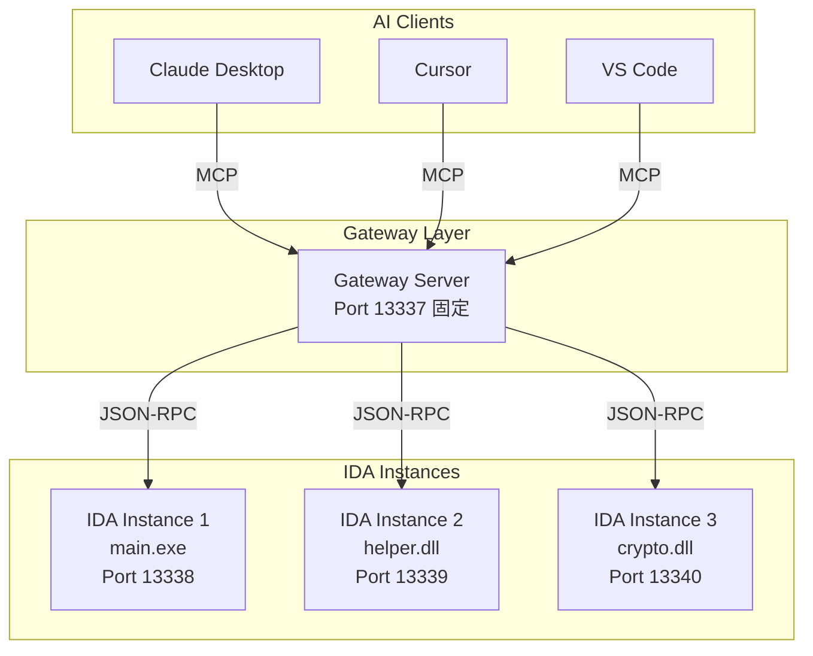
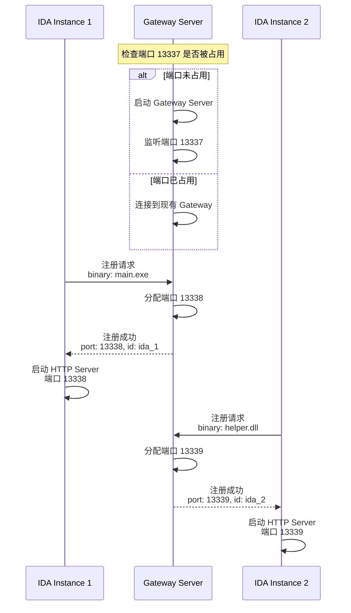
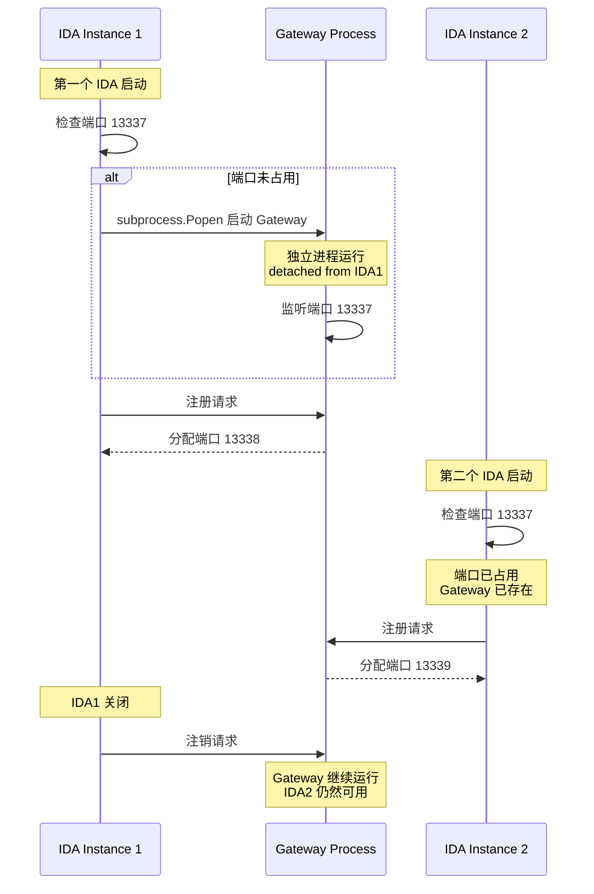
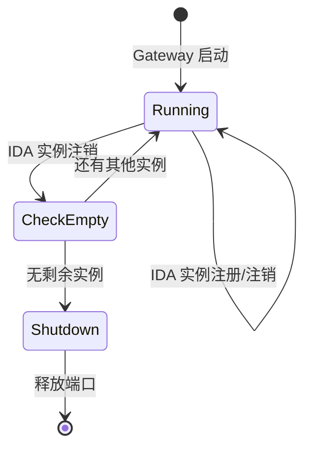
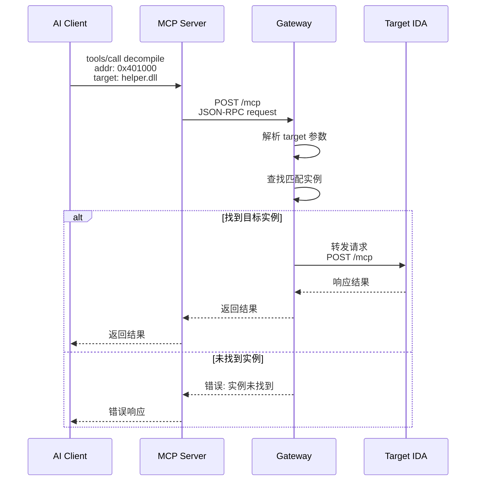

# IDA Pro MCP 多实例支持架构设计

## 1. 背景与问题

### 1.1 当前架构


**当前组件**：
- [`server.py`](../src/ida_pro_mcp/server.py) - MCP Server，通过 stdio 或 SSE 与 AI 客户端通信，代理请求到 IDA
- [`ida_mcp.py`](../src/ida_pro_mcp/ida_mcp.py) - IDA 插件加载器，在 IDA 内启动 HTTP 服务器（端口 13337）
- [`zeromcp/mcp.py`](../src/ida_pro_mcp/ida_mcp/zeromcp/mcp.py) - HTTP/SSE 服务器实现

### 1.2 问题描述

1. **单实例限制**：当前设计只支持同时连接一个 IDA 实例
2. **实际需求**：逆向分析时，一个可执行程序往往会调用多个外部链接库（DLL/SO），需要同时在多个 IDA 实例中分析
3. **端口冲突**：多个 IDA 实例无法同时使用固定端口 13337

## 2. 设计目标

1. 支持多个 IDA 实例同时运行并提供服务
2. AI 客户端能够区分和选择目标 IDA 实例
3. 保持向后兼容，单实例场景无需额外配置
4. 自动管理端口分配和实例生命周期
5. 所有 IDA 实例关闭后自动释放 Gateway 端口

## 3. 架构设计

### 3.1 整体架构



### 3.2 组件职责

#### 3.2.1 Gateway Server（网关服务器）

**职责**：
- 监听固定端口（13337），作为 AI 客户端的唯一入口
- 管理所有 IDA 实例的注册和注销
- 路由请求到目标 IDA 实例
- 聚合多实例的工具列表和资源
- 处理实例生命周期（心跳检测、自动清理）

**新增文件**：`src/ida_pro_mcp/gateway.py`

#### 3.2.2 IDA Plugin Server（IDA 插件服务器）

**职责**：
- 启动时向 Gateway 注册自己
- 使用动态分配的端口
- 提供实例标识信息（二进制名称、路径、自定义 ID）
- 关闭时向 Gateway 注销
- 定期发送心跳

**修改文件**：`src/ida_pro_mcp/ida_mcp.py`

#### 3.2.3 MCP Server（保持不变）

**职责**：
- 与 AI 客户端通信（stdio/SSE）
- 代理请求到 Gateway Server

**修改文件**：`src/ida_pro_mcp/server.py`（修改目标端口逻辑）

### 3.3 实例标识方案

每个 IDA 实例通过以下信息标识：

```python
@dataclass
class IDAInstance:
    instance_id: str          # 唯一标识符，如 "ida_1", "ida_2"
    binary_name: str          # 二进制文件名，如 "main.exe"
    binary_path: str          # 完整路径
    port: int                 # 分配的端口
    registered_at: datetime   # 注册时间
    last_heartbeat: datetime  # 最后心跳时间
    metadata: dict            # 额外元数据（架构、基址等）
```

### 3.4 API 设计

#### 3.4.1 新增 MCP 工具

| 工具名 | 描述 | 参数 |
|--------|------|------|
| `list_instances` | 列出所有已注册的 IDA 实例 | 无 |
| `switch_instance` | 切换当前目标实例 | `instance_id` 或 `binary_name` |
| `get_current_instance` | 获取当前目标实例信息 | 无 |

#### 3.4.2 现有工具扩展

所有现有工具增加可选参数 `target`：
- 不指定：使用当前默认实例
- 指定 `instance_id`：路由到特定实例
- 指定 `binary_name`：按名称匹配实例

示例：
```json
{
  "method": "decompile",
  "params": {
    "addr": "0x401000",
    "target": "helper.dll"
  }
}
```

#### 3.4.3 Gateway 内部 API

| 端点 | 方法 | 描述 |
|------|------|------|
| `/gateway/register` | POST | IDA 实例注册 |
| `/gateway/unregister` | POST | IDA 实例注销 |
| `/gateway/heartbeat` | POST | 心跳更新 |
| `/gateway/instances` | GET | 获取实例列表 |

### 3.5 端口管理策略



**端口分配规则**：
- Gateway 固定端口：13337
- IDA 实例端口范围：13338-13400
- 动态分配，避免冲突

### 3.6 生命周期管理

#### 3.6.1 Gateway 进程模型

**采用独立进程方案**：Gateway 作为独立后台进程运行，与任何 IDA 实例的生命周期解耦。



#### 3.6.2 Gateway 启动实现

```python
import subprocess
import sys
import socket

GATEWAY_PORT = 13337

def is_port_in_use(port: int) -> bool:
    with socket.socket(socket.AF_INET, socket.SOCK_STREAM) as s:
        return s.connect_ex(('127.0.0.1', port)) == 0

def start_gateway_if_needed() -> bool:
    if is_port_in_use(GATEWAY_PORT):
        # Gateway 已存在
        return True
    
    # 启动独立 Gateway 进程
    gateway_script = os.path.join(os.path.dirname(__file__), 'gateway.py')
    
    if sys.platform == 'win32':
        # Windows: 使用 CREATE_NEW_PROCESS_GROUP 和 DETACHED_PROCESS
        CREATE_NEW_PROCESS_GROUP = 0x00000200
        DETACHED_PROCESS = 0x00000008
        subprocess.Popen(
            [sys.executable, gateway_script],
            creationflags=CREATE_NEW_PROCESS_GROUP | DETACHED_PROCESS,
            close_fds=True,
            stdout=subprocess.DEVNULL,
            stderr=subprocess.DEVNULL,
        )
    else:
        # Unix: 使用 start_new_session 实现 daemon
        subprocess.Popen(
            [sys.executable, gateway_script],
            start_new_session=True,
            close_fds=True,
            stdout=subprocess.DEVNULL,
            stderr=subprocess.DEVNULL,
        )
    
    # 等待 Gateway 启动
    for _ in range(50):  # 最多等待 5 秒
        if is_port_in_use(GATEWAY_PORT):
            return True
        time.sleep(0.1)
    
    return False
```

#### 3.6.2 Gateway 关闭逻辑



**自动关闭条件**：
- 所有 IDA 实例都已主动注销
- 且超过 30 秒无新注册
- Gateway 自动关闭，释放端口

#### 3.6.3 实例状态管理（简化方案）

**设计原则**：不使用心跳超时自动移除机制

**原因**：
- IDA 在逆向分析过程中可能长时间无响应（大型二进制分析、反编译等）
- 心跳超时会导致误判，错误移除正常运行的实例
- 简化设计，减少复杂性

**实例移除时机**：
1. IDA 正常关闭时主动注销
2. 用户手动调用 `remove_instance` 工具
3. Gateway 重启时清空所有注册（实例需重新注册）

**端口/ID 冲突处理**：
- 新实例注册时，如果请求的端口已被占用，自动分配下一个可用端口
- 如果 instance_id 冲突，自动生成新的 ID（如 ida_1 -> ida_2）
- 这样即使旧实例未正常注销，新实例也能正常工作

**可选的状态检查**：
- 提供 `check_instance_health` 工具，按需检查实例是否响应
- AI 客户端可在调用失败时主动检查并清理无响应实例

### 3.7 请求路由流程



## 4. 数据结构设计

### 4.1 实例注册请求

```python
class RegisterRequest(TypedDict):
    binary_name: str           # 二进制文件名
    binary_path: str           # 完整路径
    preferred_port: NotRequired[int]  # 首选端口（可选）
    metadata: NotRequired[dict]       # 额外元数据
```

### 4.2 实例注册响应

```python
class RegisterResponse(TypedDict):
    success: bool
    instance_id: str           # 分配的实例 ID
    port: int                  # 分配的端口
    gateway_url: str           # Gateway URL
```

### 4.3 实例信息

```python
class InstanceInfo(TypedDict):
    instance_id: str
    binary_name: str
    binary_path: str
    port: int
    registered_at: str         # ISO 格式时间
    last_heartbeat: str
    is_current: bool           # 是否为当前默认实例
    metadata: dict
```

## 5. 兼容性设计

### 5.1 向后兼容

- 单实例场景：行为与当前完全一致
- 不指定 `target` 参数时，使用默认实例（第一个注册的或最后切换的）
- 现有 MCP 客户端配置无需修改

### 5.2 降级策略

- 如果 Gateway 不可用，IDA 插件回退到直接模式（当前行为）
- 支持环境变量 `IDA_MCP_LEGACY=1` 强制使用旧模式

## 6. 实现计划

### 6.1 Phase 1: Gateway 基础架构

1. 创建 `gateway.py` - Gateway Server 实现
2. 实现实例注册/注销 API
3. 实现端口分配逻辑
4. 实现请求路由

### 6.2 Phase 2: IDA 插件改造

1. 修改 `ida_mcp.py` - 添加 Gateway 注册逻辑
2. 实现动态端口分配
3. 实现心跳机制
4. 实现优雅关闭

### 6.3 Phase 3: MCP Server 适配

1. 修改 `server.py` - 支持 Gateway 模式
2. 添加实例管理工具
3. 扩展现有工具支持 `target` 参数

### 6.4 Phase 4: 测试与文档

1. 单元测试
2. 集成测试
3. 更新 README 文档
4. 更新 CLAUDE.md

## 7. 文件变更清单

| 文件 | 变更类型 | 描述 |
|------|----------|------|
| `src/ida_pro_mcp/gateway.py` | 新增 | Gateway Server 实现 |
| `src/ida_pro_mcp/ida_mcp.py` | 修改 | 添加 Gateway 注册逻辑 |
| `src/ida_pro_mcp/server.py` | 修改 | 支持 Gateway 模式 |
| `src/ida_pro_mcp/ida_mcp/rpc.py` | 修改 | 添加实例管理工具 |
| `src/ida_pro_mcp/ida_mcp/utils.py` | 修改 | 添加实例相关类型定义 |
| `README.md` | 修改 | 更新文档 |
| `CLAUDE.md` | 修改 | 更新开发指南 |

## 8. 风险与缓解

| 风险 | 影响 | 缓解措施 |
|------|------|----------|
| Gateway 单点故障 | 所有实例不可用 | 实现降级到直接模式 |
| 端口耗尽 | 无法注册新实例 | 限制最大实例数，提供清理机制 |
| 心跳丢失误判 | 实例被错误移除 | 增加重试机制，延长超时时间 |
| 跨进程通信延迟 | 响应变慢 | 优化序列化，使用连接池 |

## 9. 未来扩展

1. **远程 IDA 支持**：Gateway 支持远程 IDA 实例注册
2. **负载均衡**：多个相同二进制的实例间负载均衡
3. **会话持久化**：Gateway 重启后恢复实例信息
4. **Web UI**：提供实例管理的 Web 界面
